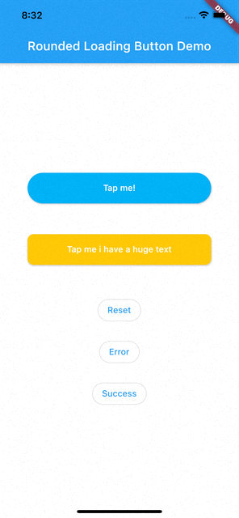

# handle_button

HandleButton is a Flutter package with a simple implementation of an animated loading button, complete with success and error animations.

## Installation

Add this to your pubspec.yaml:

    dependencies:
        handle_button: ^1.0.0

## Usage

### Import

    import 'package:handle_button/handle_button.dart';

### Simple Implementation

    final HandleButtonController _btnController = HandleButtonController();

    void _doSomething() async {
        Timer(Duration(seconds: 3), () {
            _btnController.success();
        });
    }

    HandleButton(
        child: Text('Tap me!', style: TextStyle(color: Colors.white)),
        controller: _btnController,
        onPressed: _doSomething,
    )

The Rounded Loading Button has many configurable properties, including:

* `duration` - The duration of the button animation
* `loaderSize` - The size of the CircularProgressIndicator
* `animateOnTap` -  Whether to trigger the loading animation on the tap event
* `resetAfterDuration` - Reset the animation after specified duration, defaults to 15 seconds
* `errorColor` - The color of the button when it is in the error state
* `successColor` - The color of the button when it is in the success state
* `successIcon` - The icon for the success state
* `failedIcon` - The icon for the failed state
* `loadingWidget` - The widget for the loading state

## Contributions

All contributions are welcome!